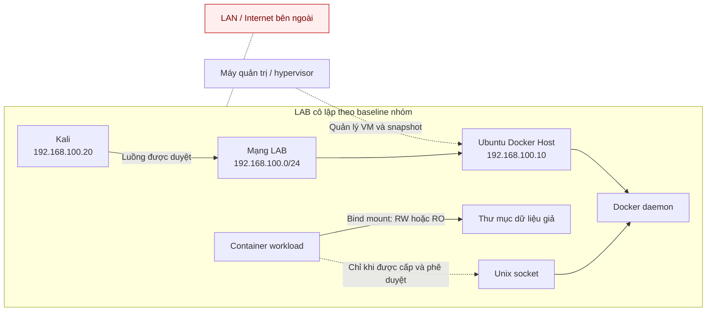

# Threat Model: Docker Host & Daemon

**Thành viên phụ trách:** Lê Đình Phương — 23IT.B170  
**Trạng thái:** Bản nghiên cứu và kế hoạch mốc 1; chưa phải kết quả kiểm thử.

## 1. Baseline LAB

Theo báo cáo tiến độ ngày 08/10/2026 và thông tin trưởng nhóm cung cấp:

- Docker Host: Ubuntu Server 24.04.5, Docker Engine 28.5.2, Compose 2.40.3.
- Smoke test `hello-world` chạy thành công.
- Docker network `172.30.0.0/24`, `internal=true`.
- Docker API TCP `2375/2376` không mở.
- Kali `.20` và Ubuntu `.10` kết nối trên `192.168.100.0/24`; không NAT, gateway hoặc Internet.
- Snapshot được ghi nhận: `docker-baseline` và `docker-lab-network-ready`.

Thông tin trên mô tả LAB nền của nhóm. Thành viên phụ trách chưa có output validation tự chạy hoặc được lưu; quyền truy cập LAB chung và snapshot được phép dùng **chưa xác nhận**.

## 2. Tài sản và ranh giới tin cậy

| Thành phần | Vai trò | Yêu cầu bảo vệ |
|---|---|---|
| Ubuntu Docker Host | Máy chạy Docker trong LAB | Không ảnh hưởng máy thật; giữ baseline và khả năng rollback |
| Docker daemon | Quản lý container, image, network và volume | Chỉ cho principal được phép truy cập; không expose TCP |
| Unix socket | Kênh Docker client giao tiếp với daemon | Không mount vào workload; không sửa quyền trên baseline |
| Container workload | Chạy ứng dụng thử nghiệm | Không privileged/host namespace/device nếu chưa được duyệt |
| Thư mục dữ liệu giả | Dữ liệu dùng để kiểm tra bind mount | Đường dẫn hẹp; không chứa dữ liệu thật |
| Kali và mạng LAB | Máy kiểm thử và đường kết nối tới Ubuntu | Chỉ truy cập đích/cổng được duyệt; không có egress |
| Snapshot | Điểm khôi phục môi trường | Không tự khôi phục hoặc thay đổi trên LAB chung |

Sơ đồ biểu diễn kiến trúc mục tiêu theo tài liệu nhóm, không phải sơ đồ đã được thành viên xác minh trực tiếp.

## 3. Luồng tin cậy

1. **Kali → Ubuntu:** chỉ qua mạng LAB, tới đích và cổng được ghi trong test case.
2. **Docker client → daemon:** client gửi yêu cầu qua Unix socket; quyền truy cập phụ thuộc quyền socket và endpoint/context đang dùng.
3. **Container → socket → daemon:** nếu socket được mount và tiến trình có quyền truy cập, container có thể gửi yêu cầu tới daemon. Với daemon rootful, khả năng điều khiển daemon có thể dẫn đến ảnh hưởng rộng tới host.
4. **Container → bind mount → host path:** read-write cho phép thay đổi dữ liệu trong phạm vi mount và quyền filesystem; read-only ngăn ghi qua mount đó, không đồng nghĩa toàn bộ filesystem container là chỉ đọc.
5. **Daemon TCP:** không thuộc luồng được phép. Không bật TCP API; baseline yêu cầu không có listener `2375/2376`.

## 4. Rủi ro host impact

| Đường rủi ro | Điều kiện | Tác động tiềm tàng | Kiểm soát dự kiến | Trạng thái |
|---|---|---|---|---|
| Docker socket trong container | Socket được mount và tiến trình có quyền truy cập | Yêu cầu daemon thực hiện thao tác Docker vượt quá mức cô lập dự kiến; phạm vi tùy quyền daemon | Không mount socket vào workload; socket thật chỉ thử trên clone dùng một lần sau phê duyệt riêng | Đã nhận diện; chưa kiểm thử |
| Thành viên nhóm `docker` | Tài khoản có quyền truy cập daemon socket | Có thể điều khiển daemon; với daemon rootful, quyền này thường tương đương quyền quản trị cao trên host | Hạn chế thành viên; không sửa membership baseline | Chưa kiểm tra cấu hình thực tế |
| Bind mount read-write | Container có quyền ghi vào đường dẫn host được mount | Có thể tạo/sửa/xóa dữ liệu trong phạm vi mount và quyền filesystem | Dùng thư mục giả, path hẹp; so sánh với read-only | Kế hoạch; chưa kiểm thử |
| Bind mount quá rộng | Mount vượt quá nhu cầu workload | Mở rộng dữ liệu/tài nguyên host có thể bị tác động | Không mount `/` hoặc thư mục nhạy cảm; chỉ cấp path tối thiểu | Không thực hiện nếu chưa duyệt |
| Docker API TCP | Daemon listen TCP và client kết nối được | Client có thể gửi API request; tác động tùy xác thực và kiểm soát truy cập | Không bật TCP; kiểm tra listener `2375/2376` | Trưởng nhóm báo cáo không mở; thành viên chưa tự validation |
| Host namespace, privileged hoặc device | Container được cấp quyền/vùng nhìn thấy rộng | Làm giảm cô lập, tăng khả năng quan sát hoặc tác động host | Không cấp nếu workload không cần và chưa được duyệt | Kế hoạch; chưa kiểm thử |

Các mục trên là rủi ro tiềm tàng, không khẳng định LAB hiện tại có cấu hình yếu.

## 5. Giới hạn và điều kiện dừng

- Chỉ thực hiện trên LAB được nhóm phê duyệt, với dữ liệu giả.
- Không thử container escape, không bật Docker TCP API, không mount dữ liệu nhạy cảm.
- Không thay đổi `daemon.json`, systemd, quyền socket, membership nhóm `docker`, firewall, NIC, route, mạng libvirt hoặc snapshot trên baseline.
- Dừng và báo trưởng nhóm nếu lưu lượng rời LAB, workload truy cập/ghi ngoài path được phép, listener `2375/2376` xuất hiện, baseline thay đổi ngoài kế hoạch hoặc không thể rollback an toàn.

## 6. Nội dung cần xác nhận

- Quyền truy cập LAB chung và output validation `host`/`ubuntu`/`kali` áp dụng cho thành viên.
- Snapshot được phép sử dụng và người chịu trách nhiệm khôi phục.
- Các luồng mạng/cổng được phép trong test case.
- Phê duyệt test plan và GO; phê duyệt riêng nếu cần kiểm tra Docker socket thật.
