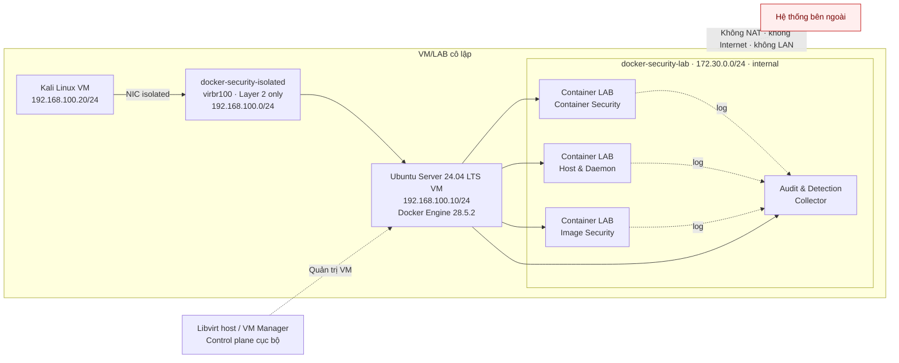

# Kiến trúc LAB Docker Security

## Sơ đồ

## Ranh giới tin cậy

- Kali và Ubuntu chỉ giao tiếp qua `docker-security-isolated`; NIC NAT `default` của cả hai VM bị disable.
- `virbr100` không có IP host, gateway, DHCP, DNS, NAT, forwarding hoặc cổng nối vào LAN vật lý.
- Kali chỉ kết nối tới subnet LAB và các cổng được ghi trong test case.
- Docker Host là ranh giới quản trị; không dùng chung với máy cá nhân hoặc dịch vụ thật.
- Container dùng dữ liệu giả, giới hạn CPU/RAM/PID và không có egress mặc định.
- Docker socket, host filesystem, privileged mode và host network bị cấm, trừ kịch bản đã duyệt và có snapshot rollback.
- Máy quản trị chỉ dùng để điều phối, thu log đã làm sạch và lưu tài liệu.

## Luồng vận hành

Trưởng nhóm tạo snapshot baseline, phê duyệt test case, mở đúng kết nối cần thiết và theo dõi log. Sau mỗi test, nhóm lưu bằng chứng đã làm sạch, khôi phục trạng thái hoặc xác minh không còn tài nguyên thử nghiệm rồi mới chuyển sang kịch bản tiếp theo.
